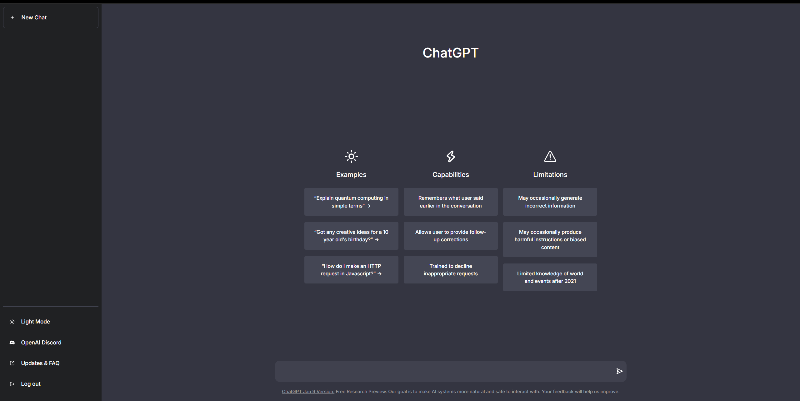

# ChatGPT Clone

This website showcases a clone of the ChatGPT interface, offering users an interactive and engaging experience similar to the original ChatGPT platform. It features a clean and modern design, with a focus on providing a responsive and user-friendly chat interface.



## Features

- **Realistic Chat Interface:** Emulates the look and feel of the ChatGPT interface with a clean, modern design.
- **Responsive Design:** Ensures the website is fully responsive and user-friendly across different devices and screen sizes.
- **Chat Functionality:** Provides an interactive chat experience, including a title for every chat and a dynamic UI for user interactions.
- **Interactive Elements:** Includes hover effects, animations, and transitions to enhance user engagement and experience.
- **Contact Information:** Provides easy access to contact details for support and inquiries.

## Technologies Used

- **React:** JavaScript library for building user interfaces.
- **Vite:** Fast build tool and development server.
- **Tailwind CSS:** Utility-first CSS framework for styling.
- **React Icons:** Provides a set of popular icons used in the UI.
- **ESLint:** Tool for identifying and fixing problems in JavaScript code.

## Installation

To run this project locally, follow these steps:

1. **Clone the Repository:**
   ```bash
   git clone https://github.com/ahmedkamal14/ChatGptClone.git
   cd ChatGptClone
2. **Install Dependencies:**
   ```bash
    npm install

3. **Run the Development Server:**
   ```bash
    npm run dev
